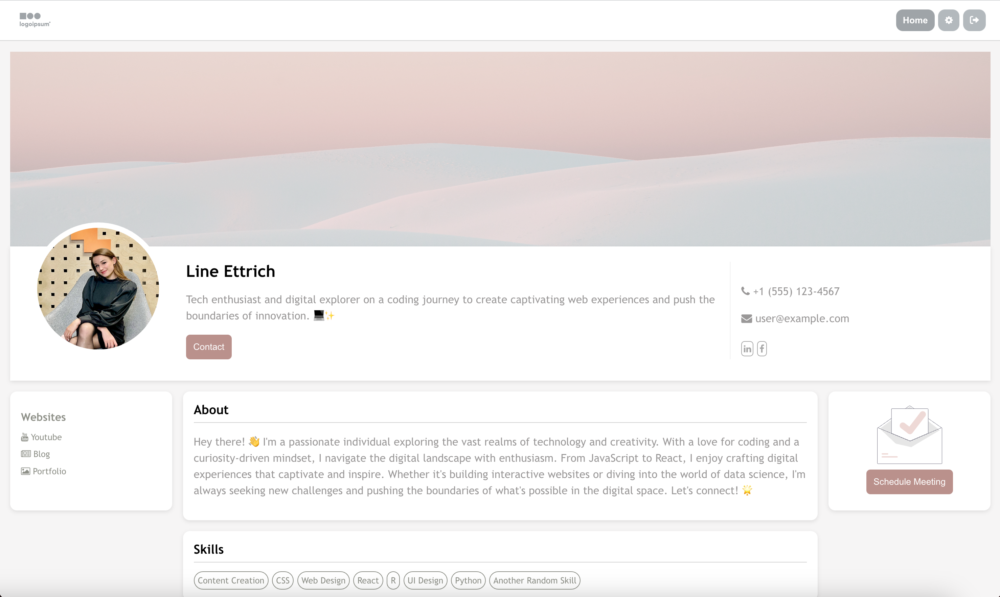
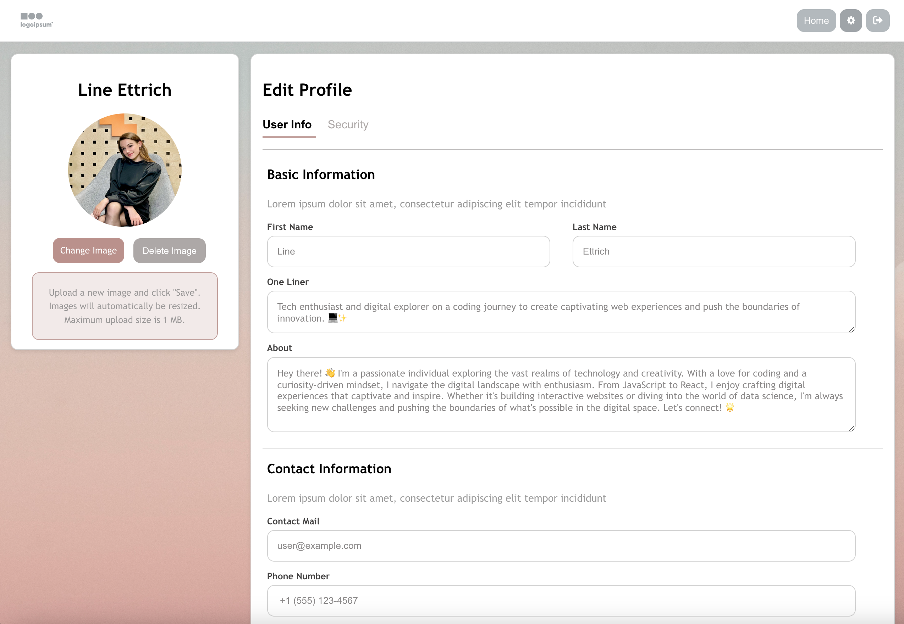

# 🌟 ProfileAuth 🚀
This React application serves as a user profile management system. Users can log in, update their profile information, and customize their settings within the application.

## 📸 Screenshots

--

--

## 🚀 Getting Started
To run this project locally, follow these steps:

1. Clone the repository.
2. Install dependencies using `npm install`.
3. Configure Firebase in firebase_setup/firebase.js 
4. Run the app with `npm start`.
5. Open [http://localhost:3000](http://localhost:3000) to view it in your browser.

## 🛠 Technologies/Tools 

- React: JavaScript library for building the user interface.
- Firebase: Services for Authentication, Storage, and Database functionalities.

## 🌅 Design Elements

- Icons from [Font Awesome](https://fontawesome.com/)
- Pre-styled alerts boxes from [Sweetalert](https://sweetalert.js.org/)
- Illustrations from [Undraw](https://undraw.co/illustrations)
- Images from [Unsplash](https://unsplash.com)

## 🌈 Features

- **User Authentication:** Securely log in, request a new password, and create a new profile.
- **Profile Updates/Customization:** Update and manage your user information and settings (e.g. contact information, social handles, skills, etc.)
- **Profile Images:** Upload and manage profile images to personalize profile.

## 🧑‍💻 Code Overview

The project structure is organized as follows:

- `src/components`: Contains individual components for different sections of the app.
- `src/assets`: Stores the default images used in the application.
- `src/firebase_setup`: Firebase configuration. 
- `src/handles`: Includes various utility functions for handling authentication, data retrieval, and more.
- `src/App.js`: Main entry point for the app.

## 📃 To Do's

- [ ] **Post Functionality:** Create, comment, delete, and like posts.
- [ ] **Social Network Functionality:** Search, add, follow, and view other users.
- [ ] **Data Management:** Allow users to delete their entire profile.
- [ ] **Component Management:** Break down profile settings into smaller components.

## 💫 Other
This is a hobby project, crafted for learning and experimentation purposes. Happy exploring! 💥
